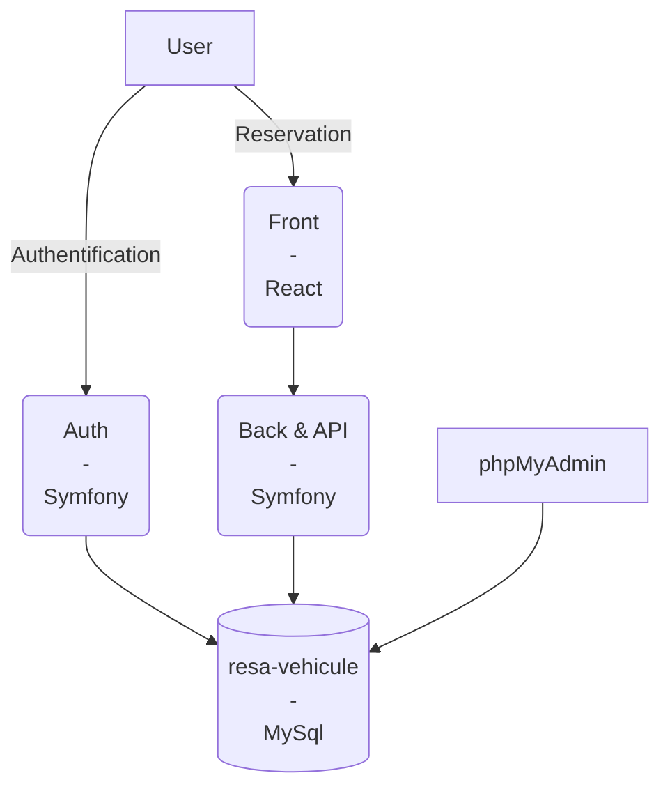
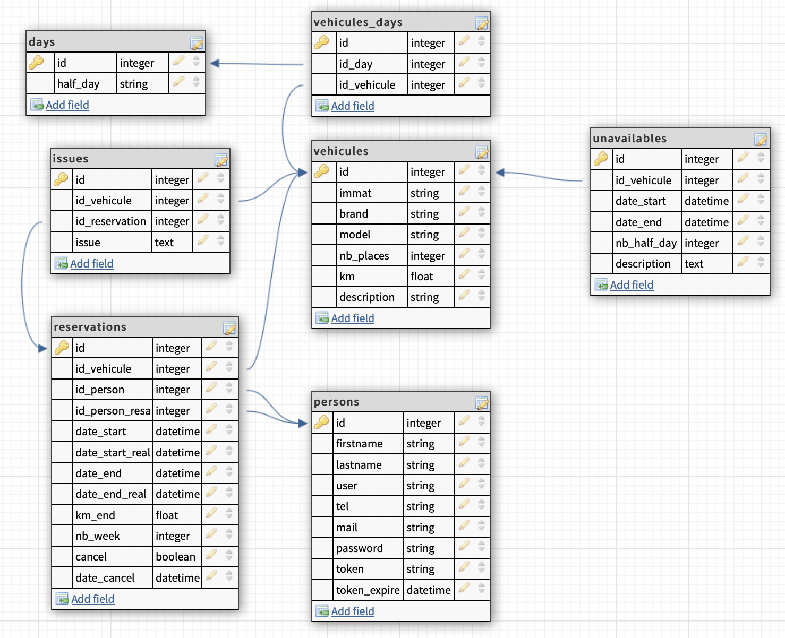

# **Get Started**

# **Summary** 

- [**Get Started**](#get-started)
- [**Summary**](#summary)
- [**Project**](#project)
  - [Diagram](#diagram)
  - [MCD](#mcd)
  - [Ports](#ports)
- [**Clone project**](#clone-project)
- [**Build \& Up**](#build--up)
- [**Composer Install \& Update**](#composer-install--update)
  - [Windows](#windows)
  - [Linux](#linux)
  

# **Project**

## Diagram



## MCD



## Ports
| Container | Port | URL |
| --------- | ---- | --- |
| React | <span style="color:white">**3000**</span> | [localhost:3000/](http://localhost:3000/) |
| Symfony Back & API | <span style="color:white">**9080**</span> | [localhost:9080/](http://localhost:9080/) |
| Symfony Authentification | <span style="color:white">**9081**</span> | [localhost:9081/](http://localhost:9081/) |
| phpMyAdmin | <span style="color:white">**9082**</span> | [localhost:9082/](http://localhost:9082/) |

# **Clone project**

```bash
git clone https://gitlab.com/lpweb2/resa-vehicule.git
cd resa-vehicule
```

# **Build & Up**

```bash
docker-compose build
docker-compose up -d
```

# **Composer Install & Update**

## Windows

```bash
# Backend
docker exec -it symfony-back composer install
docker exec -it symfony-back composer update

# Auth
docker exec -it symfony-auth composer install
docker exec -it symfony-auth composer update
```

## Linux

```bash
./launch.sh
```

- Si une erreur bash apparaît /bin/bash^M 
  
    ```bash
    sed -i -e 's/\r$//' launch.sh
    ./launch.sh
    ```

- Si une erreur bash subsiste vérifier que le **PATH** vers bash est le bon dans le script 
  
    ```bash
    which bash
    ```

    Changer dans le script #!/bin/bash par le résultat de la commande

- Si une erreur de permission apparaît 
  
    ```bash
    sudo sh ./launch.sh
    ```

    **OU**

    ```bash
    sudo ./launch.sh
    ```

La WebApp est maintenant prête à l'utilisation.


<script type="module">
  import mermaid from 'https://cdn.jsdelivr.net/npm/mermaid@9/dist/mermaid.esm.min.mjs';
  mermaid.initialize({ startOnLoad: true });
</script>